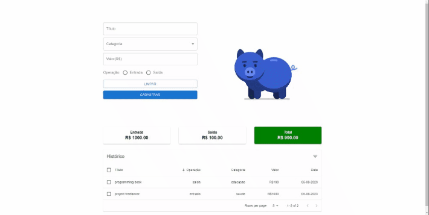

# CoinSentry

An easy way to control your finances 💰

## Authors

- [@rogigs](https://www.github.com/rogigs)

## Run Locally

Clone the project

```bash
 git@github.com:rogigs/CoinSentry.git
```

Go to the project directory

```bash
  cd CoinSentry
```

Install dependencies

```bash
  npm install
```

Start project

```bash
  npm run start
```

## Demo



## Environment Variables

To run this project, you will need to add the following environment variables to your .env file

```bash
  NEXT_PUBLIC_SERVER_CLIENT='your-url-server'
```
